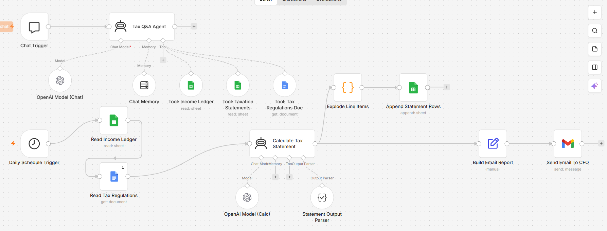

# Company Tax Agent — n8n AI Tax Automation

An end-to-end **n8n AI agent project for company tax Q&A and automated daily tax statements**.

The project combines an interactive tax Q&A agent with a scheduled tax-statement pipeline. It reads company income/expense data from Google Sheets, reads a tax-regulation document from Google Docs, uses an OpenAI model to classify and calculate tax-related values, writes line-item results back to Google Sheets, and emails a formatted statement to the CFO.

> **Important:** This repository is an educational/illustrative automation project. The included tax rules are not presented as certified tax advice. Replace the example regulation document with rules reviewed by a qualified tax professional before any real-world use.

## Features

- **Conversational Tax Q&A Agent**
  - n8n Chat Trigger
  - OpenAI chat model
  - Windowed chat memory
  - Google Sheets income ledger tool
  - Google Sheets taxation-statement history tool
  - Google Docs tax-regulation tool
  - Instruction to cite the ledger rows/regulation clauses used
  - Explicit fallback when information is not available

- **Automated Daily Tax Statement**
  - Daily schedule trigger
  - Reads the company income ledger
  - Reads the tax-regulation document
  - AI-based line-item tax classification
  - Structured JSON output validation
  - Explodes line items into spreadsheet rows
  - Appends results to the taxation statement sheet
  - Builds an HTML email report
  - Sends the report to the CFO

## Architecture



### High-level flow

```text
                         ┌──────────────────────┐
                         │    Chat Trigger      │
                         └──────────┬───────────┘
                                    │
                                    ▼
                         ┌──────────────────────┐
                         │  Tax Q&A Agent       │
                         └───┬──────┬───────┬───┘
                             │      │       │
                    ┌────────┘      │       └─────────┐
                    ▼               ▼                 ▼
              OpenAI Model     Chat Memory      Google Sheets /
                                                   Google Docs
                                                   Tools

Daily Automation:

┌────────────────────┐
│ Daily Schedule     │
│ Trigger             │
└─────────┬──────────┘
          ▼
┌────────────────────┐
│ Read Income Ledger │
└─────────┬──────────┘
          ▼
┌────────────────────┐
│ Read Tax           │
│ Regulations        │
└─────────┬──────────┘
          ▼
┌────────────────────┐       ┌────────────────────┐
│ Calculate Tax      │──────▶│ Structured Output  │
│ Statement (AI)     │       │ Parser             │
└─────────┬──────────┘       └────────────────────┘
          │
     ┌────┴─────────────┐
     ▼                  ▼
┌───────────────┐  ┌────────────────┐
│ Explode Line  │  │ Build Email    │
│ Items         │  │ Report         │
└──────┬────────┘  └───────┬────────┘
       ▼                   ▼
┌───────────────┐    ┌──────────────┐
│ Append to Tax │    │ Gmail → CFO  │
│ Statement     │    └──────────────┘
└───────────────┘
```

## Repository structure

```text
company-tax-agent-n8n/
├── workflows/
│   └── company-tax-agent.json
├── docs/
│   ├── architecture.md
│   └── setup.md
├── examples/
│   ├── income-ledger.csv
│   ├── tax-regulations.md
│   └── expected-output.json
├── assets/
│   └── workflow-architecture.png
├── .env.example
├── .gitignore
├── CONTRIBUTING.md
├── LICENSE
└── README.md
```

## Workflow components

| Component | Purpose |
|---|---|
| Chat Trigger | Starts an interactive tax question session |
| Tax Q&A Agent | Answers company tax questions using connected tools |
| OpenAI Model (Chat) | Language model for the conversational agent |
| Chat Memory | Maintains the last 10 messages/items for a session |
| Tool: Income Ledger | Gives the Q&A agent access to income/expense ledger data |
| Tool: Taxation Statements | Gives the agent access to generated statement history |
| Tool: Tax Regulations Doc | Gives the agent access to regulation text |
| Daily Schedule Trigger | Starts the automated statement process daily at 12:30 |
| Read Income Ledger | Retrieves ledger rows |
| Read Tax Regulations | Retrieves the regulation document |
| Calculate Tax Statement | Classifies rows and computes tax totals |
| OpenAI Model (Calc) | Model used by the calculation agent |
| Statement Output Parser | Enforces the expected JSON structure |
| Explode Line Items | Converts the structured line-item array into spreadsheet rows |
| Append Statement Rows | Stores generated rows in the taxation statement sheet |
| Build Email Report | Creates the HTML summary |
| Send Email To CFO | Delivers the daily statement |

## Expected AI output

The calculation agent is designed to produce:

- `period`
- `line_items[]`
  - `TransactionID`
  - `amount`
  - `category`
  - `taxable_or_deductible`
  - `regulation_ref`
  - `notes`
- `gross_income`
- `total_deductions`
- `taxable_income`
- `tax_rate`
- `tax_liability`

The workflow instructs the model not to invent regulation clauses. If a case is not covered by the supplied regulation text, it should return `NOT COVERED` and explain the situation in `notes`.

## Data flow

### Input

**Income ledger**

Typical fields:

```text
TransactionID
Date
Description
Amount
Category
Notes
```

**Tax regulations**

A Google Docs document containing the rules used by the calculation agent.

### Processing

1. Retrieve ledger rows.
2. Retrieve the regulation text.
3. Pass both to the calculation agent.
4. Classify each ledger row.
5. Determine gross income and deductions.
6. Calculate taxable income and tax liability according to the supplied regulation text.
7. Validate the response against a structured schema.
8. Write line items to the taxation statement sheet.
9. Generate an HTML summary.
10. Email the report to the CFO.

## Security

The workflow supplied in this repository has been **sanitized for GitHub**.

Do **not** commit:

- n8n API keys
- OpenAI API keys
- Google OAuth tokens
- Gmail credentials
- private spreadsheets/documents
- personal email addresses
- n8n instance identifiers
- production environment variables
- database credentials

The public workflow contains placeholders such as:

```text
REPLACE_WITH_GOOGLE_SHEETS_CREDENTIAL_ID
REPLACE_WITH_GOOGLE_DOCS_CREDENTIAL_ID
REPLACE_WITH_OPENAI_CREDENTIAL_ID
REPLACE_WITH_GMAIL_CREDENTIAL_ID
YOUR_CFO_EMAIL@example.com
REPLACE_WITH_SPREADSHEET_ID
REPLACE_WITH_REGULATIONS_DOC_ID
```

## Setup

See [`docs/setup.md`](docs/setup.md) for the full import and credential configuration procedure.

At a high level:

1. Install/run n8n.
2. Import `workflows/company-tax-agent.json`.
3. Create Google Sheets OAuth credentials.
4. Create Google Docs OAuth credentials.
5. Create the OpenAI credential/model connection.
6. Create Gmail OAuth credentials.
7. Replace the spreadsheet/document placeholders.
8. Configure the CFO recipient.
9. Prepare the income ledger and taxation-statement sheets.
10. Review the tax-regulation document.
11. Test the chat agent.
12. Test the scheduled statement workflow.
13. Activate the workflow only after validating the calculations.

## Suggested GitHub repository description

> AI-powered n8n tax automation agent for company tax Q&A, regulation-aware tax classification, daily tax statements, Google Sheets reporting, and automated CFO email delivery.

## Suggested topics

```text
n8n
n8n-workflow
ai-agent
ai-automation
tax-automation
accounting-automation
finance-automation
openai
google-sheets
google-docs
gmail
workflow-automation
business-automation
```

## Limitations

This project intentionally uses an LLM for classification and calculation. For production financial systems, consider adding deterministic validation around:

- arithmetic
- tax-rate selection
- deductible-expense rules
- duplicate transactions
- missing transaction IDs
- negative/invalid amounts
- regulation versioning
- effective dates
- human approval before filing or payment
- audit logs

A strong production design should treat the LLM as a reasoning/classification layer rather than the sole source of truth for financial calculations.

## Future improvements

- Add deterministic JavaScript/Python tax calculation after classification.
- Add approval/review workflow before emailing or filing.
- Add exception routing for `NOT COVERED` transactions.
- Add regulation version/date metadata.
- Add audit logs for every calculation.
- Add monthly/quarterly reporting.
- Add dashboard integration with Power BI.
- Add role-based access controls.
- Add automated unit/regression tests with fixed ledger fixtures.
- Add confidence/risk flags to line items.

## License

MIT — see [`LICENSE`](LICENSE).
